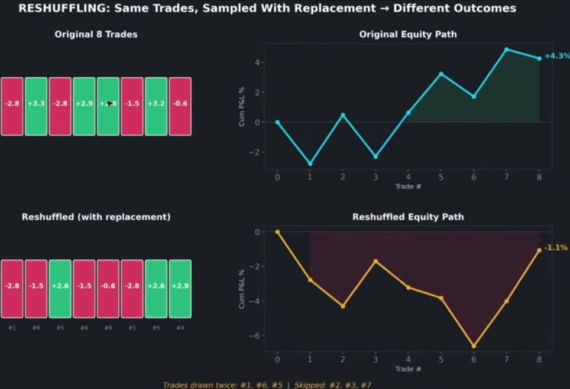
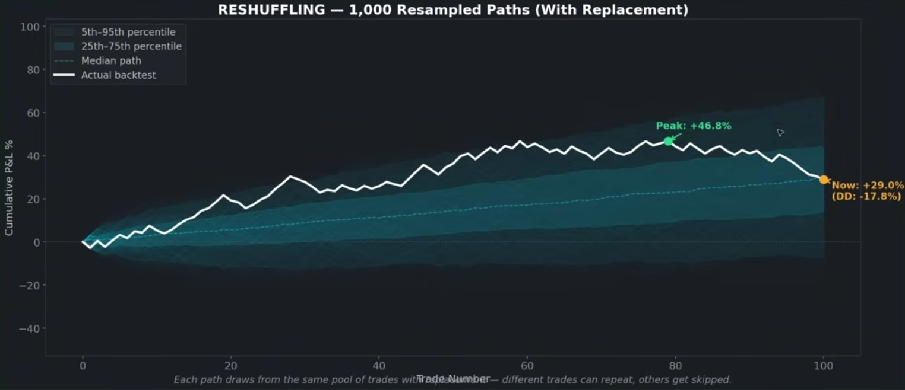
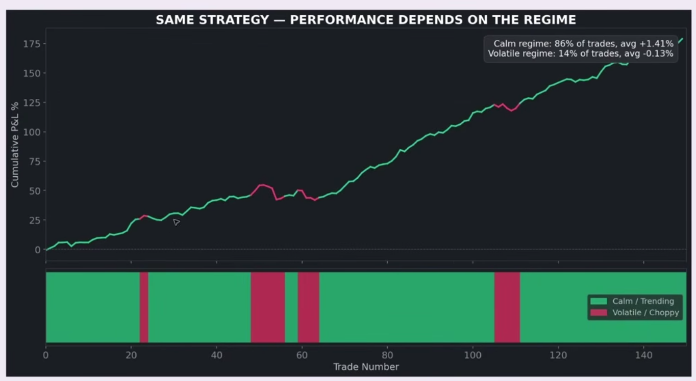
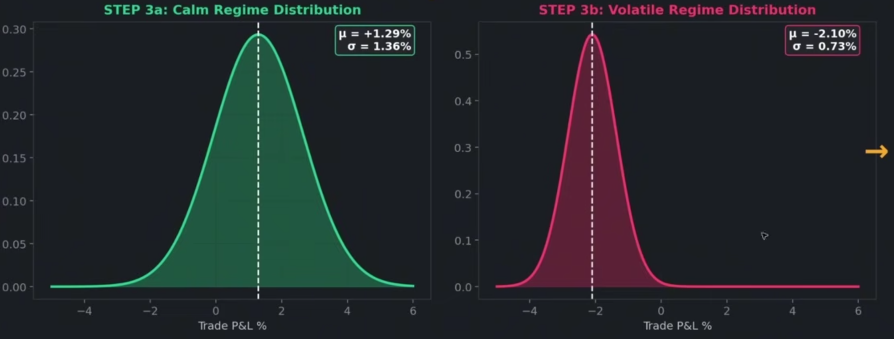
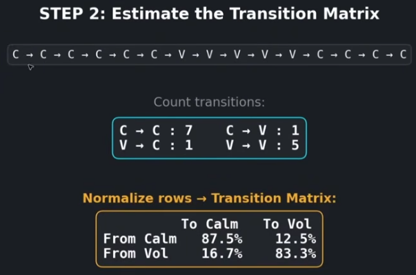

(https://www.youtube.com/watch?v=jGhk-uSrtII)

using Monte Carlo on backtest, can get confidence interval of EV per trade
ex: 90% CI of EV: [-0.252%, +0.467%] per trade

Monte Carlo simulation shows you alternate realities

- a singular backtest is one realization of the stochastic process, monte carlo shows you many
- lets you explore the impacts of path dependence on your equity curves, which impacts drawdown distributions, final equity distributions, runup distributions, variance etc

# Reshuffling


take the distribution of trade outcomes

- sample from the distribution with replacement, until we created one full equity path
- performs this many times
- can see how the random chance of the order in which we took the trade returns from our original real equity path form backtest, can impact the characteristics of alternative equity path that had different luck/random chance in the order that they drew the returns per trade


by drawing many times we can

- look at percentile of outcomes
- drawdown distributions
- ending account distributions

# Regime switching Monte Carlo

problem with reshuffling is that trades might be correlated with the trade that came before them

- its likely because regime dependence that the order of trades in the og backtest had real meaning
- can't just resample complete randomly from the distribution
  
- strategies perform differently in different regimes
- distrbution of trade returns in a calm/trending regime may be completely different than if it were in a volatile/choppy regime

Steps:

1. Classify each trade into a regime (calm or volatile)
   
   look at the 2 different distributions of trades

2. Estimate Transition Matrix
   

3. Simulate trade

- Randomly select starting regime and sample trade
- then using transition matrix select another regime, and sample from that, and sample another trade from that regime, report for N trades

Now we have a regime aware resampled equity path

# Sampling from per position (round-trip)

- position is analytically meaningful, as an independent unit of risk it's one expression of one trading idea ("long AAPL here, and exit here")
- Its PnL is one draw from whatever stochastic process geenrates my returns

exit is just bookkeeping slice of that bet

# Regime switching

regime data is best calculated in Analytics which we can use in Regime Switching Monte Carlo

- to classify each bar what regime it is in
- and also to calculte each position/trade what regime it takes place in

## classifying position over multiple regimes

options:
soft label:
-instead of one label per trade {calm:0.7, vol:0.3} (time-weighted over position's life)
-can compute from PositionRecord's openTime/closeTime + barData (after we classify regime for bars)

dominate regime with threshhold:
-if regime occupies >60% of position's life, tag it as the regime

Solution:
tag the trade with the regime at entry:

the question we want to answer with regime tag "should I take this signal in this regime?"

- the only regime information we have when we make that decision is the regime at entry
- tagging by entry regime directly measures "how do trades entered in regime X perform"

## should regime classficiation happen after run completes or should it run during run?

write classifer as a causal function
`classify(bars[0...i]) -> regime`, run it after backtest, iterating over stored bar data, and labeling each bar using only its past

- can retune without rerunning backtest
- no look-ahead bias

## How to classify regime

Volatility thresholding

- compute daily realized vol
- label by quantiles of the trailing distribution, splitting into volatile and calm periods

- allow custom parameter based classificaiton

volatile = trailing vol above 70th percentile
calm = trailing vol below 30th percentile

## workflow

classifyRegime(State& , double volThreshold, double calmThreshold, int rollingWindow)

Output: `vector<Regime>` aligned with barSnapshots

1. calculate rolling volatity

- compute per-bar returns
- realized vol at bar i = std dev of the last W returns (eg. W = 20 trading days)

1. Causal threshold
   at each bar i, look at window of the last T vol values (T = 252, one trading year), and compute

- high*i = 75th percentile of {vol*{i-T+1}...vol_i}
- low_i = 60th percentile of the same window

threshold drift over time: "volatile in 2020 means something different than in 2017

3. hysteresis state machine

walk forward through bars, carrying one piece of state: the current regime

```c
if vol_i or thresholds_i don't exist yet:      label[i] = WARMUP
else if state == CALM  and vol_i > high_i:     state = VOLATILE
else if state == VOLATILE and vol_i < low_i:   state = CALM
label[i] = state      (if past warmup)
```

- intial state = CALM after warmup

4. Tagging positions

- Take position's entry time (openTime), find index of that bar (date -> index map)
- position.regime = label[entry_index]

# Parallelization

should be able to parallize monte carlo runs and store results

- what should I produce and store from each monte carlo run?

1. full pnl path, <pnl, regime>

Each run gets a seeded generator

- can't pass generator by reference, since it would then be shared and ran concurrently
- each run needs own generator (either constructed inside run from seed, or passed by value)
  - seed per run (determinstic) = base_seed + run_index

analytics on the equity paths can be performed after parllel sampling of trades are done and we have full run results

can then compute statistics from them in parallel

Monte Carlo run:
to avoid data races when sampledTrades add their sampled pnlPath:

- first create a `vector<vector<SampledTrade>>` in sampleNTrades of size N
- so that each sampleTrade only moves their generated pnlPath to their index

# Analytics

from vector<sampledTrades<pnl, regime>>

- calculate percentile of outcomes
- drawdown distributions
- ending account distrbutions
- peak and trough

void computePathStatistics(double startingBalance);

for each of path in std::vector<std::vector<SampledTrade>> sampledTrades

produce
struct Outcome{
  peak, trough, end account balance, drawdown
}
and store in 
std::vector<Outcome> outcomes;
